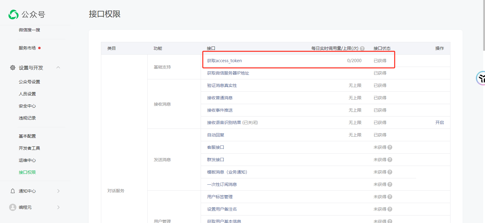

# 微信JSSDK权限签名算法

> 我们在开发中经常会遇到H5使用微信功能的需求，比如：扫一扫、拍照上传（上传头像）、分享朋友圈等功能。而这些功能，都需要获取微信签名信息

本节我会讲述如何获取JS-SDK使用权限签名算法

官网参考地址：https://developers.weixin.qq.com/doc/offiaccount/OA_Web_Apps/JS-SDK.html#62

前端的调用方式

```js
//导包
import wx from 'weixin-js-sdk'
import { getSign } from '@/api/system/common'

try {
    let { entry } = await getSign()

    wx.config({
        debug: false,
        appId: entry.appId,
        nonceStr: entry.nonceStr,
        timestamp: entry.timestamp,
        signature: entry.signature,
        jsApiList: ['scanQRCode']
    })
    wx.ready(() => {
        wx.scanQRCode({
            needResult: 0, // 默认为0，扫描结果由微信处理，1则直接返回扫描结果，
            scanType: ['qrCode'] // 可以指定扫二维码还是一维码，默认二者都有
        })
        this.isScanLocked = false
    })
} catch (e) {
    console.log(e)
    this.isScanLocked = false
}
```

下面重点讲一下，后端的这个getSign实现

> 我们直接从签名算法的实现类讲起

由于微信公众号说明，每天access_token的获取次数，不能超过2000次，所以我们需要对获取的access_token进行缓存，这里我是通过redis将其缓存起来，避免用户多次上传头像或使用扫一扫功能，而导致系统access_token资源匮乏



```java
@Service
public class JsapiSignServiceImpl implements JsapiSignService {
    private String publicAccountAppId;
    private String publicAccountSecret;
    @Value("${frontUrl}")
    private String frontUrl;
    @Autowired
    private RedisService redisService;

    @Override
    public ApiResult getSign() {
        String accessToken = getAccessToken();
        String ticket = getTicket(accessToken);
        System.out.println(accessToken);
        System.out.println(ticket);
        //获取签名信息
        Map<String, String> map = WxJsapiSignUtil.sign(ticket, frontUrl+"/");
        map.put("appId",publicAccountAppId);
        ApiResult apiResult = ApiResult.build();
        apiResult.setEntry(map);
        return apiResult;
    }

    @Override
    public String getTicket(String accessToken) {
        //获取当前用户ID,用于缓存jsapi_ticket
        String key = "jsapi_ticket_"+accessToken;
        //判断是否存在jsapi_ticket
        String jsapi_ticket = redisService.getOpsForValue(key);
        if (StringUtils.isNotEmpty(jsapi_ticket)){
            return jsapi_ticket;
        }
        try {
            CloseableHttpClient httpclient = HttpClients.createDefault();
            String url = "https://api.weixin.qq.com/cgi-bin/ticket/getticket?access_token=%s&type=jsapi";
            url = String.format(url, accessToken);
            HttpGet httpGet = new HttpGet(url);
            CloseableHttpResponse response = httpclient.execute(httpGet);
            //请求成功后处理openId
            String result = EntityUtils.toString(response.getEntity());
            JSONObject jsonObject = JSONObject.parseObject(result);
            System.out.println(jsonObject);
            System.out.println(jsonObject.toString());
            System.out.println("errcode"+jsonObject.get("errcode"));
            System.out.println("errmsg"+jsonObject.get("errmsg"));
            if(Objects.nonNull(jsonObject.get("errcode")) && "ok".equals(jsonObject.get("errmsg"))) {
                jsapi_ticket = (String) jsonObject.get("ticket");
                int expires_in = (int) jsonObject.get("expires_in");
                redisService.setOpsForValueWithTime(key, jsapi_ticket, expires_in);
                return jsapi_ticket;
            }
        } catch (IOException e) {
            e.printStackTrace();
        }
        throw new ServiceException("授权失败");
    }

    @Override
    public String getAccessToken() {
        //获取当前用户ID,用于缓存access_token
        String key = "access_token";
        //判断是否存在accessToken
        String access_token = redisService.getOpsForValue(key);
        if (StringUtils.isNotEmpty(access_token)){
            return access_token;
        }
        try {
            CloseableHttpClient httpclient = HttpClients.createDefault();
            String url = "https://api.weixin.qq.com/cgi-bin/token?grant_type=client_credential&appid=%s&secret=%s";
            url = String.format(url, publicAccountAppId, publicAccountSecret);
            HttpGet httpGet = new HttpGet(url);
            CloseableHttpResponse response = httpclient.execute(httpGet);
            //请求成功后处理openId
            String result = EntityUtils.toString(response.getEntity());
            JSONObject jsonObject = JSONObject.parseObject(result);
            System.out.println(jsonObject);
            System.out.println(jsonObject.toString());
            System.out.println("errcode"+jsonObject.get("errcode"));
            System.out.println("errmsg"+jsonObject.get("errmsg"));
            if(Objects.isNull(jsonObject.get("errcode"))) {
                access_token = (String) jsonObject.get("access_token");
                int expires_in = (int) jsonObject.get("expires_in");
                redisService.setOpsForValueWithTime(key, access_token, expires_in);
                return access_token;
            }
        } catch (IOException e) {
            e.printStackTrace();
        }
        throw new ServiceException("授权失败");
    }
}

```


