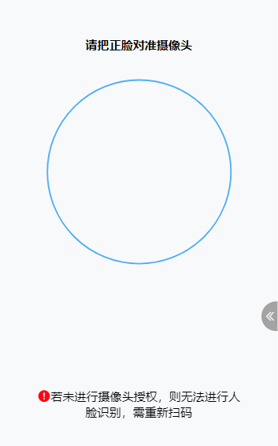

# 前端人脸识别

> 在企业开发当中，人脸识别是我们必不可少的需求之一。本篇我会讲述，前端如何开启前置摄像头功能并获取流数据据

主要是利用navigator.mediaDevices获取用户的媒体设备，但这个功能存在一个问题，当用户拒绝获取摄像头授权时，页面会出现空白。需要刷新页面，部分手机可能需要清除缓存

需要注意的是，以下代码开启摄像头的条件

- 访问地址为localhost
- 访问地址为https协议

```vue
<template>
  <div class="login-container">
    <div v-show="canvasShow" class="login-form">
      <p class="titleInfo">请把正脸对准摄像头</p>
      <div class="regInfo">
        <!-- <div class="tip">没有检测到脸</div> -->
        <div class="canvas">
          <!--video用于显示媒体设备的视频流，自动播放-->
          <video id="video" ref="vd" autoplay playsinline style="width: 250px; height: 250px;"></video>
          <!--描绘video截图-->
          <canvas id="canvas" ref="cav" width="250" height="250"></canvas>
        </div>
      </div>
      <form id="myForm" ref="myForm" action="/api/frame/facelogin/checkFace" method="post" enctype="multipart/form-data">
      </form>
      <div class="footer-tip">
        <div style="margin: 0 46px;"><i class="el-icon-warning custom-icon"></i>若未进行摄像头授权，则无法进行人脸识别，需重新扫码</div>
      </div>
    </div>
    <div v-show="tipShow" class="tipShow">
      <el-alert title="验证成功" type="success" center :closable="false" show-icon>
      </el-alert>
    </div>
    <div v-show="errorShow" class="tipShow">
      <el-alert title="验证失败" type="error" center :closable="false" show-icon>
      </el-alert>
    </div>
  </div>
</template>
<script>
import { checkFace } from '@/api/faceRecognition.js'
export default {
  name: 'FaceRecognition',
  components: {},
  props: {
    name: {
      type: String,
      required: true
    },
    idNum: {
      type: String,
      required: true
    }
  },
  data() {
    return {
      code: '',
      imgUrl: '',
      formData: {},
      vdstate: false,
      states: false,
      canvasShow: true,
      tipShow: false,
      errorShow: false,
      timer: ''
    }
  },
  beforeDestroy() {
    clearInterval(this.timer)
    this.timer = ''
  },
  created() {
    var _this = this
    let a = JSON.stringify(navigator)
    // console.log(this.$route.query.code)
    // this.handlecode()
    this.$nextTick(() => {
      var _this = this
      // console.log('video', this.$refs['vd'])
      // return
      // 访问用户媒体设备的兼容方法
      function getUserMedia(constrains, success, error) {
        var video = _this.$refs['vd']
        if (navigator.mediaDevices.getUserMedia) {
          // 最新标准API
          let myCons = { ...constrains, video: true }
          navigator.mediaDevices
            .getUserMedia(constrains)
            .then((stream) => {
              video.srcObject = stream
              video.play()
              _this.vdstate = true
            })
            .catch(error)
        } else if (navigator.webkitGetUserMedia) {
          // webkit内核浏览器
          navigator.webkitGetUserMedia(constrains).then(success).catch(error)
        } else if (navigator.mozGetUserMedia) {
          // Firefox浏览器
          navagator.mozGetUserMedia(constrains).then(success).catch(error)
        } else if (navigator.getUserMedia) {
          // 旧版API
          navigator.getUserMedia(constrains).then(success).catch(error)
        }
      }
      var video = this.$refs['vd']
      var canvas = this.$refs['cav']
      // debugger
      var context = canvas.getContext('2d')

      // 成功的回调函数
      function success(stream) {
        _this.vdstate = true
        // 兼容webkit内核浏览器
        var CompatibleURL = window.URL || window.webkitURL
        // 将视频流设置为video元素的源
        video.src = CompatibleURL.createObjectURL(stream)
        // 播放视频
        video.play()
      }
      // 异常的回调函数
      function error(error) {
        alert('访问用户媒体设备失败，请重新进行摄像头授权')
        console.log('访问用户媒体设备失败：', error.name, error.message)
      }
      if (
        navigator.mediaDevices.getUserMedia ||
        navigator.getUserMedia ||
        navigator.webkitGetUserMedia ||
        navigator.mozGetUserMedia
      ) {
        // 调用用户媒体设备，访问摄像头
        getUserMedia(
          {
            video: { width: 250, height: 250 }
          },
          success,
          error
        )
      } else {
        alert('你的浏览器不支持访问用户媒体设备')
      }
      // 获取图片
    })
  },
  mounted: function () {
    setInterval(this.handleClick, 3000)
  },
  // 组件更新
  updated: function () { },
  methods: {
    handleClick() {
      let _this = this

      if (!this.vdstate) {
        return false
      }
      if (!_this.states) {
        // 注册拍照按钮的单击事件
        let video = this.$refs['vd']
        let canvas = this.$refs['cav']
        // let form = this.$refs["myForm"];
        let context = canvas.getContext('2d')
        // 绘制画面
        context.drawImage(video, 0, 0, 250, 250)
        let base64Data = canvas.toDataURL('image/jpg')

        // 封装blob对象
        // let blob = this.dataURItoBlob(base64Data, 'camera.jpg') // base64 转图片file
        let formData = new FormData()
        formData.append('img', base64Data)
        formData.append('name', this.name)
        formData.append('idNo', this.idNum)

        this.imgUrl = base64Data
        // 调用后台接口检查人脸
        checkFace({
          'img': base64Data,
          'name': this.name,
          'idNo': this.idNum
        }).then((res) => {
          _this.states = true
          _this.canvasShow = false
          let result = JSON.parse(res.entry) || ''
          if (result.Identical) {
            // 检测通过
            _this.tipShow = true
            console.log('成功')
            // 计时1-2秒
            _this.timer = setInterval(() => {
              _this.$emit('faceCheckResult', true)
            }, 1500)
          } else {
            _this.$emit('faceCheckResult', false, result.Message)
            return false
          }
        })
      }
    },
    dataURItoBlob(base64Data) {
      var byteString
      if (base64Data.split(',')[0].indexOf('base64') >= 0) { byteString = atob(base64Data.split(',')[1]) } else byteString = unescape(base64Data.split(',')[1])
      var mimeString = base64Data.split(',')[0].split(':')[1].split(';')[0]
      var ia = new Uint8Array(byteString.length)
      for (var i = 0; i < byteString.length; i++) {
        ia[i] = byteString.charCodeAt(i)
      }
      return new Blob([ia], { type: mimeString })
    }
  }
}
</script>
<style lang="scss" scoped>
.el-alert__title,
.el-alert__icon {
  font-size: 20px;
}

.regInfo {
  width: 250px;
  height: 250px;
  overflow: hidden;
  border: 2px solid #51AEF3;
  border-radius: 50%;
  margin: 0 auto;
  position: relative;
  z-index: 1000;

  .tip {
    position: absolute;
    top: 0;
    width: 100%;
    height: 40px;
    line-height: 40px;
    background: rgba(0, 0, 0, 0.2);
    text-align: center;
  }

  .canvas {
    position: absolute;
    top: 0;
    width: 100%;
    z-index: 1;
  }
}

.titleInfo {
  text-align: center;
  font-weight: 700;
  padding: 30px 0 20px;
}
.login-form {
  margin-top: 20px;
}

.tipShow {
  position: absolute;
  top: 50%;
  left: 50%;
  transform: translateX(-50%) translateY(-50%);
}

.footer-tip {
  position: fixed;
  left: 50%;
  transform: translateX(-50%);
  width: 100vw;
  bottom: 0px;
  margin-bottom: 50px;
  text-align: center;

  .custom-icon {
    color: #ff0010;
    font-size: 18px;
  }

  .refresh-button {
    color: rgba(76, 131, 253, 1);
  }
}</style>
```



当前端将用户人脸截取后，后端只需要与人脸识别库进行对比，获取人脸相识度即可

