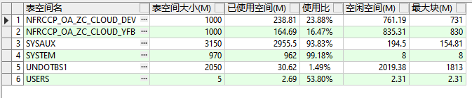
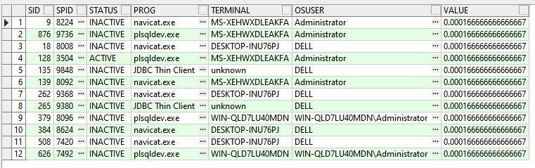
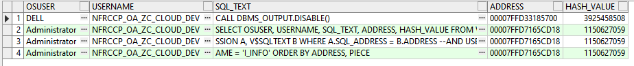
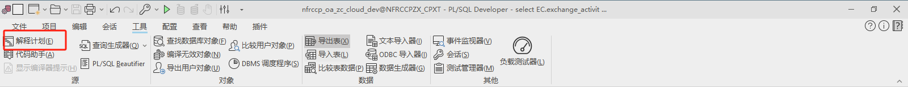
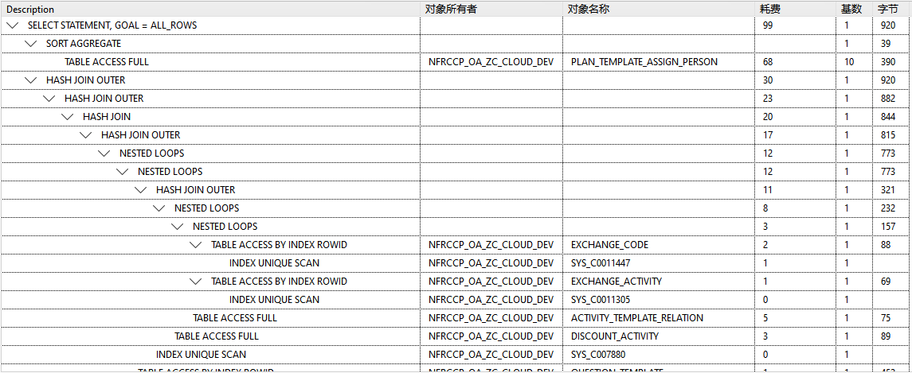

# SQL性能优化

## 1.若出现插入速度慢或者无法插入数据的情况下，先检查表空间

```sql
SELECT UPPER(F.TABLESPACE_NAME) "表空间名",
D.TOT_GROOTTE_MB "表空间大小(M)",
D.TOT_GROOTTE_MB - F.TOTAL_BYTES "已使用空间(M)",
TO_CHAR(ROUND((D.TOT_GROOTTE_MB - F.TOTAL_BYTES) / D.TOT_GROOTTE_MB * 100, 2), '990.99') || '%' "使用比",
F.TOTAL_BYTES "空闲空间(M)",
F.MAX_BYTES "最大块(M)"
FROM (SELECT TABLESPACE_NAME,
        ROUND(SUM(BYTES) / (1024 * 1024), 2) TOTAL_BYTES,
        ROUND(MAX(BYTES) / (1024 * 1024), 2) MAX_BYTES 　　
        FROM SYS.DBA_FREE_SPACE 　　
        GROUP BY TABLESPACE_NAME) F,
(SELECT DD.TABLESPACE_NAME,
           ROUND(SUM(DD.BYTES) / (1024 * 1024), 2) TOT_GROOTTE_MB 　　
           FROM SYS.DBA_DATA_FILES DD 　　
           GROUP BY DD.TABLESPACE_NAME) D
WHERE D.TABLESPACE_NAME = F.TABLESPACE_NAME
--and F.TABLESPACE_NAME = '<tablespace>'
ORDER BY 1;
```



**UNDOTBS1是回滚表空间，越大越能够储存回滚段。在做提交操作或者复杂运算的时候这里的使用率会飞涨。这个表空间是系统自动回收的，当系统判断资源不需要被使用之后表空间将会被回收。但若这个表空间长时间不回收就需要留意是否存在大批量的提交操作甚至锁表情况出现。**

##  2.服务器端出现多个Oracle进程并CPU占用率高

```sql
SELECT A.SID,
       SPID,
       STATUS,
       SUBSTR(A.PROGRAM, 1, 40) PROG,
       A.TERMINAL,
       OSUSER,
       VALUE / 60 / 100 VALUE
  FROM V$SESSION A, V$PROCESS B, V$SESSTAT C
 WHERE C.STATISTIC# = 12
   AND C.SID = A.SID
   AND A.PADDR = B.ADDR 
   -- AND STATUS = 'ACTIVE'  
 ORDER BY VALUE DESC;
```



> 进一步深挖究竟执行什么导致CPU使用率高

```sql
SELECT OSUSER, USERNAME, SQL_TEXT, ADDRESS, HASH_VALUE
FROM V$SESSION A, V$SQLTEXT B
WHERE A.SQL_ADDRESS = B.ADDRESS
--AND USERNAME = 'I_INFO' 
ORDER BY ADDRESS, PIECE;
```



```sql
# 根据ADDRESS和HASH_VALUE来找到对应SQL执行性能消耗情况
SELECT HASH_VALUE,
       BUFFER_GETS,
       DISK_READS,
       EXECUTIONS,
       PARSE_CALLS,
       CPU_TIME
  FROM V$SQLAREA
 WHERE HASH_VALUE = 1977390476
   AND ADDRESS = HEXTORAW('000000018B83E578');
```

## 3.查询数据库正在执行的SQL

```sql
SELECT b.sid oracleID, 
b.username Oracle用户, 
b.serial#, 
spid 操作系统ID, 
paddr, 
sql_text 正在执行的SQL, 
b.machine 计算机名 
FROM v$process a, v$session b, v$sqlarea c 
WHERE a.addr = b.paddr 
AND b.sql_hash_value = c.hash_value;
```

## 4.查询执行最慢的sql

```sql
select *
from (select sa.SQL_TEXT,
sa.SQL_FULLTEXT,
sa.EXECUTIONS "执行次数",
round(sa.ELAPSED_TIME / 1000000, 2) "总执行时间",
round(sa.ELAPSED_TIME / 1000000 / sa.EXECUTIONS, 2) "平均执行时间",
sa.COMMAND_TYPE,
sa.PARSING_USER_ID "用户ID",
u.username "用户名",
sa.HASH_VALUE
from v$sqlarea sa
left join all_users u
on sa.PARSING_USER_ID = u.user_id
where sa.EXECUTIONS > 0
order by (sa.ELAPSED_TIME / sa.EXECUTIONS) desc)
where rownum <= 50;
```

## 5.查看数据库锁表

```sql
select p.spid,
a.serial#,
c.object_name,
b.session_id,
b.oracle_username,
b.os_user_name
from v$process p, v$session a, v$locked_object b, all_objects c
where p.addr = a.paddr
and a.process = b.process
and c.object_id = b.object_id;
```

## 6.干掉所有锁死表

```sql
declare cursor mycur is
select b.sid,b.serial#
　　from v$locked_object a,v$session b
　　where a.session_id = b.sid group by b.sid,b.serial#;
 
 
begin
  for cur in mycur
    loop  
     execute immediate ( 'alter system  kill session  '''||cur.sid || ','|| cur.SERIAL# ||''' ');
     end loop;
 
end;
```

## 7.Explain的使用

在PLSQL中，可以选中要分析的SQL语句，判断其索引的利用率，以及哪张表没有利用到索引





在sqlplus中可以使用

```sql
explain plan for select * from w;
--查看索引使用明细
select * from table(dbms_xplan.display);
```

参数解释

- 基数(Rows)：Oracle估计的当前步骤的返回结果集行数和mysql类似，不一定准确
- 字节(Bytes)：执行SQL对应步骤返回的字节数
- 耗费(COST)、CPU耗费：Oracle估计的该步骤的执行耗费和CPU耗费

### 7.1.Explain分析

#### 7.1.1.explain执行顺序

- 根据Operation缩进判断，缩进最多的最先执行；
- Operation缩进相同时，最上面的是最先执行的；

#### 7.1.2.访问数据的方法

- 全表扫描
- ROWID扫描
- 访问索引

> 全表扫描（TABLE ACCESS FULL）

全表扫描时从第一个区(EXTENT)的第一个块(BLOCK)开始扫描，一直扫描的到表的高水位线(High Water Mark)，这个范围内的数据块都会扫描到

随着数据量越多，高水位线也就越高，也就是说需要扫描的数据库越多，自然扫描所需要的IO越多，时间也越多

**注意：数据量越多，全表扫描所需要的时间就越多，即使我们删了数据，高位水线并不会改变，也就是同样需要扫描那么多数据块**

> ROWID扫描（TABLE ACCESS BY ROWID）

ROWID也就是表数据行所在的物理存储地址，所谓的ROWID扫描是通过ROWID所在的数据行记录去定位。ROWID是一个伪列，数据库里并没有这个列

举一个ROWID序列：AAAecHAAFAAAIYrAAH，**前6位表示对象编号(Data Object number)，其后3位文件编号(Relative file number)，接着其后6位表示块编号(Block number)， 再其后3位表示行编号(Row number)**。

ROWID编码方法是：A ~ Z表示0到25；a ~ z表示26到51；0~9表示52到61；+表示62；/表示63；刚好64个字符。

> 访问索引（TABLE ACCESS BY INDEX SCAN）

- 索引唯一扫描（INDEX UNIQUE SCAN）
- 索引全扫描（INDEX FULL SCAN）
- 索引范围扫描（INDEX RANGE SCAN）
- 索引快速全扫描（INDEX FAST FULL SCAN）
- 索引跳跃式扫描（INDEX SKIP SCAN）

#### 7.1.3.表连接方法

- 排序合并连接（merge sort join） merge sort join是先**将关联表的关联列各自做排序**，然后**从各自的排序表中抽取数据，到另一个排序表中做匹配**

- 嵌套循环连接（Nested loop join） Nested loops 工作方式是循环从一张表中读取数据(驱动表outer table)，然后访问另一张表（被查找表 inner table,通常有索引）。驱动表中的每一行与inner表中的相应记录JOIN。类似一个嵌套的循环。**对于被连接的数据子集较小的情况，nested loop连接是个较好的选择**

- 哈希连接（Hash join） 散列连接是CBO 做大数据集连接时的常用方式，优化器使用两个表中较小的表（或数据源）利用连接键在内存中建立散列表，**然后扫描较大的表并探测散列表，找出与散列表匹配的行。**

- 笛卡尔连接（Cross join） 如果两个表做表连接而没有连接条件，而会产生笛卡尔积，在实际工作中应该**尽可能避免笛卡尔积**
  
