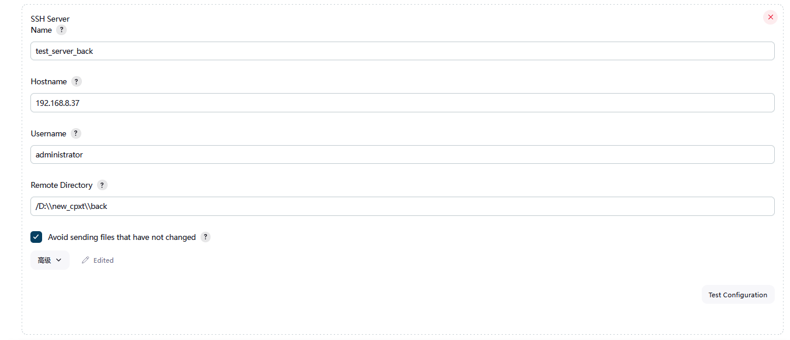
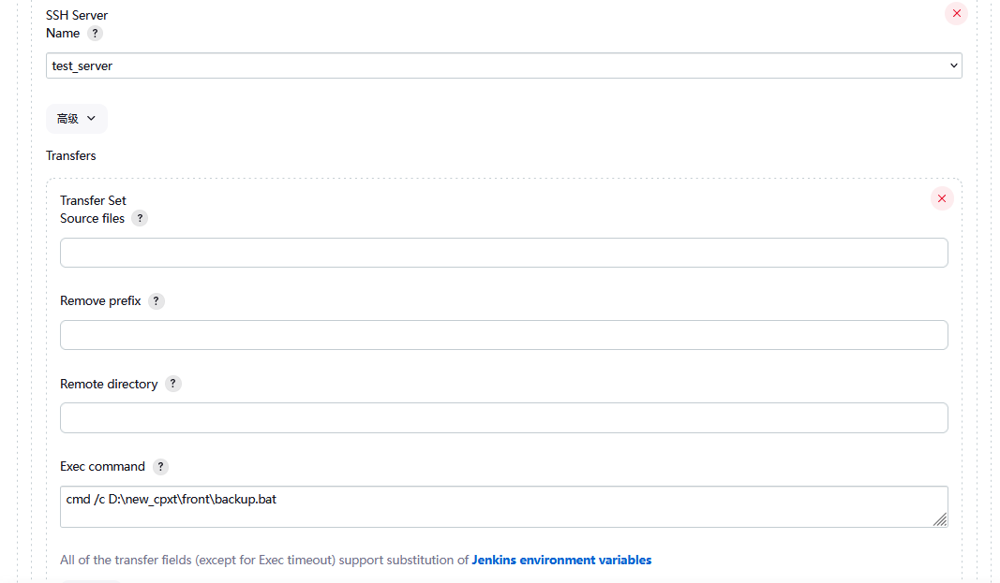

# Jenkins远程部署至Windows

## 1.Jenkins版本选择

> **Jenkins部署文档**
>
> 本文档主要针对Jenkins从Linux自动化部署到windows的教程

为了避免JDK版本不支持而引起的各种问题，建议安装2.401版本

## 2.插件安装

### 2.1.插件下载入口


### 2.2.远程连接插件安装


> 针对SVN安装对应插件


安装JDK参数选择插件，用于后面指定JDK版本的，原因是Jenkins2.401支持最低的jdk版本是11，所以我们要指定jdk8，需要下载此插件


> Jenkins汉化插件


> 其他插件


## 3.环境配置

### 3.1.Tools信息配置

首先我们可以在Tool中指定Maven、JDK、Node的位置


### 3.2.远程操作信息的配置

其次，针对windows的远程部署，我们可以在System中配置【Publish over CIFS】和【Publish over SSH】的基本信息

> Publish over CIFS


> Publish over SSH





**这里需要注意，因为我们远程操作的目录是new_cpxt，那么在远程额windows主机上，我们需要将new_cpxt文件夹属性设置为共享**

### 3.3.证书配置

接下来，我们需要配置证书账号，也就是对应我们的Git或SVN账号了


## 4.工程的搭建

安装完插件后，就可以搭建我们的工程项目

### 4.1.后端部署操作

当我们的项目是maven项目，那可以按照我的流程往下看，如果是其他类型的项目，到这就可以划走了


首先是JDK版本的配置，用来指定你项目运行的JDK版本


配置SVN地址和账号


然后我们设置发送文件前或build前的操作，比如：我们可以停止远程服务


接着我们设置前置操作，例如文件备份


然后就到了我们编写打包命令的时候了


构建后操作

如：运行jar包需要配合windows脚本去实现


### 4.2.前端项目搭建

#### 4.2.1.选择FreeStyle，自定义内容


#### 4.2.2.指定仓库地址


#### 4.2.3.设置构建前操作



#### 4.2.4.设置执行脚本


```shell
cd /home/admin/.jenkins/workspace/new_cpxt_front #进入项目目录，这个目录指的是docker容器内的路径，如果是基于docker搭建的jenkins的话
npm config set registry https://registry.npmmirror.com
npm config get registry #检测npm是否切换成功
npm install #安装依赖
npm run build:prod #打包
rm -rf dist.tar.gz #删除上次打包生成的压缩文件
tar -czvf dist.tar.gz dist/ #打包
```

#### 4.2.5.设置构建后操作


## 5.windows准备工作

windows文件夹结构


### 5.1.远程连接服务安装

我使用的远程连接工具是，尽量保持一致，以免不必要的问题

OpenSSH-Win64-v9.2.0.0.msi

### 5.2.后端脚本编写

在windows上远程运行jar，需要将这个jar安装为系统服务

实现过程

#### 5.2.1.下载WinSW.NET4.exe

https://gitcode.com/winsw/winsw/releases?utm_source=csdn_github_accelerator&isLogin=1

将WinSW.NET4.exe改为与jar包名一致的名称


#### 5.2.2.编写与文件名相同的xml文件


```xml
<service>
<id>zc_cloud</id>
<name>zc_cloud</name>
<description>This service runs zc_cloud system.</description>
<executable>java</executable>
<arguments>-jar "%BASE%\zc_cloud.jar" --spring.profiles.active=yfb</arguments>
<log mode="roll" />
<onfailure action="restart" />
</service>
```

#### 5.2.3.安裝服务

比如我的文件名：zc_cloud.jar

```bash
zc_cloud.exe install

zc_cloud.exe restart   #重启服务

zc_cloud.exe stop      #停止服务

zc_cloud.exe uninstall #卸载服务
```

#### 5.2.4.安装完后，系统会显示以下服务


#### 5.2.5.windows中后端停止、备份、运行脚本


> stop.bat

```bash
net stop "zc_cloud"
exit 0
```

> backup.bat

```bash
@echo off
set source_file=D:\new_cpxt\back\zc_cloud.jar
set a="%date:~0,4%.%date:~5,2%.%date:~8,2%.%time:~0,2%.%time:~3,2%.%time:~6,2%"
set backup_file=D:\new_cpxt\backup\back\zc_cloud.jar.%a%
copy %source_file% %backup_file%
exit
```

> start.bat

```bash
net start "zc_cloud"
exit 0
```


### 5.3.前端脚本编写

#### 5.3.1.将文件压缩操作安装为系统服务


- 将WinSW.NET4.exe名称改为服务名称
- 配置xml文件

```xml
<service>
<id>UnzipFile</id>
<name>UnzipFile</name>
<description>This service runs UnzipFile system.</description>
<executable>tar</executable>
<arguments>-xf "%BASE%\dist.tar.gz</arguments>
<log mode="roll" />
<onfailure action="restart" />
</service>
```

### 5.3.2备份以及执行解压操作


> backup.bat

```bat
@echo off
set source_file=D:\new_cpxt\front\dist.tar.gz
set a="%date:~0,4%.%date:~5,2%.%date:~8,2%.%time:~0,2%.%time:~3,2%.%time:~6,2%"
set backup_file=D:\new_cpxt\backup\front\dist.tar.gz.%a%
copy %source_file% %backup_file%
exit
```

> startUnzipFile.bat

```bat
net start "UnzipFile"
```

## 6.操作人员账号权限分配

### 6.1.账号分配


### 6.2.权限配置


## 7.总结

按照以上操作完之后，我们的项目就能正常构建了。如果构建报错了，请检查下配置是否有误，远程连接出问题，部署的代码是否确实文件导致无法运行等，必要时可尝试将windows重启，避免应SSH问题导致部署失败
